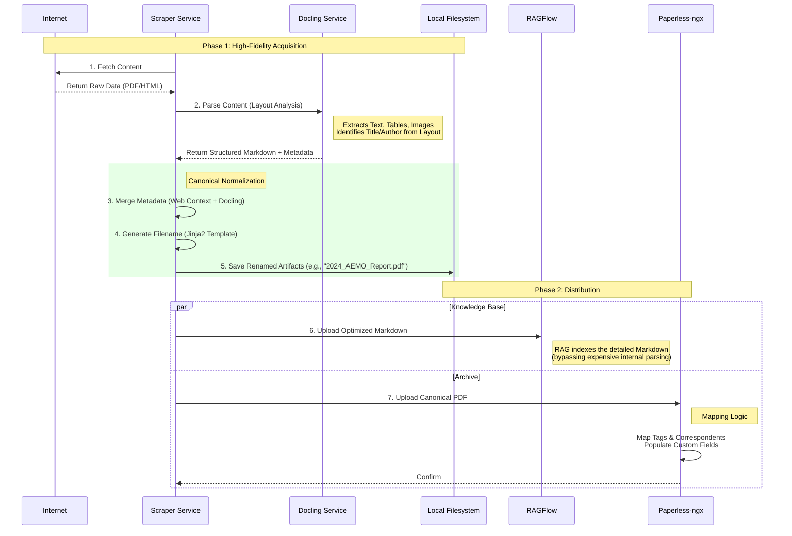

# Consolidated Architecture: Enhanced Scraper Pipeline

## Overview
This document unifies the proposed enhancements—**Docling Architecture**, **Jinja2 Naming**, and **Paperless Metadata**—into a single cohesive "Gold Standard" workflow.

The architecture abandons the "siloed" approach in favor of a linear pipeline where **Docling** is the central parser, providing high-fidelity Markdown for both RAG and Archival processes.

## The Logic Flow

## Detailed Stage Breakdown

### 1. Acquisition & Normalization
*   **Action**: Scraper fetches content (HTML/PDF).
*   **Parsing**: Files are sent to **Docling**, which uses vision/layout models to produce "Layout-Aware Markdown".
    *   *Why?* Replaces Tika/Trafilatura with a unified, superior parser that handles tables and complex layouts correctly.

### 2. Metadata Enrichment
We combine two sources:
1.  **Context (Web)**: High-trust data (e.g., "Published Date" from the link text).
2.  **Semantic (Docling)**: Document-internal data (e.g., "Title" from the page header, "Authors" from the byline).
*   *Note:* Tika (Physical Metadata) is an optional layer if forensics are needed, but Docling provides the semantic metadata needed for RAG.

### 3. Canonical Naming (Jinja2)
*   **Engine**: **Jinja2** templating.
*   **Input**: The merged metadata dictionary.
*   **Pattern**: Defined in config, e.g., `{{ date }}_{{ organization }}_{{ title | slugify }}.pdf`.
*   **Result**: Valid, deterministic filenames on disk (no more `report_final_v3.pdf`).

### 4. RAGFlow Ingestion
*   **Input**: High-quality **Markdown** from Docling.
*   **Benefit**: This is "pre-parsed", saving RAGFlow from guessing layout. Tables and headers are preserved, significantly improving retrieval quality.

### 5. Archival (Paperless-ngx)
*   **Input**: The normalized file (Original PDF for PDFs, or PDF generated from Markdown for HTML).
*   **Metadata**: The `PaperlessClient` handles:
    *   **Tags**: Name -> ID Auto-mapping.
    *   **Correspondents**: Name -> ID Auto-mapping.
    *   **Custom Fields**: Storing `Original URL`, `Page Count`, and `Scrape Date`.

## Implementation Checklist
1.  **Docling**: Standardize on Docling for all parsing.
2.  **Jinja2**: Implement renaming logic in the pipeline.
3.  **Paperless**: Upgrade client to handle metadata mapping.
