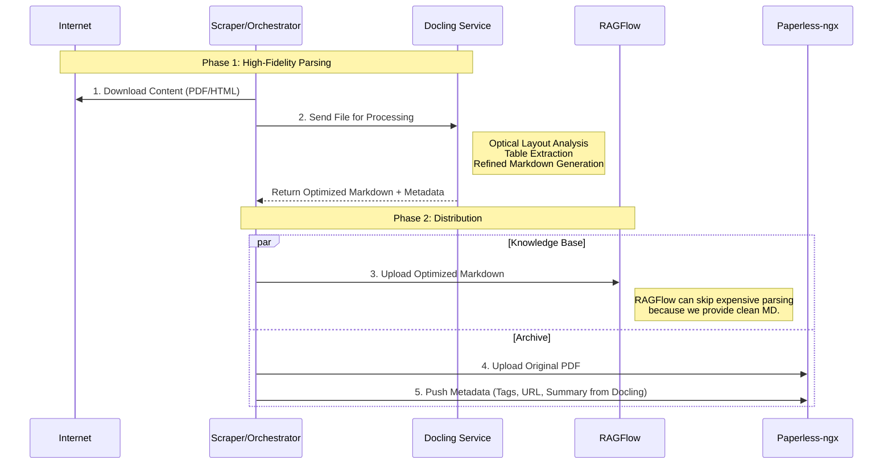

# Architecture Variant: Docling-Centric Pipeline

## The User's Idea
> "Sequence: Scraper -> Docling -> RAGFlow"

## Does it make sense?
**Yes, absolutely.** using Docling as the **centralized parser** is a "Gold Standard" architecture.

Docling (by IBM) is significantly more powerful than Tika or Trafilatura. It uses computer vision models to understand layout, correctly extracting tables, headers, and reading order from complex PDFs and webpages.

### The "Push" Clarification
Docling is typically a library/service that *returns* data. It likely won't "push" to RAGScan on its own. The **Orchestrator** will act as the glue.

## Revised Logic Flow

## Benefits of this efficiency
1.  **Skip RAG processing**: RAGFlow is resource-heavy when parsing. If we feed it pre-cooked Markdown from Docling, RAGFlow just indexes it. This saves massive compute on the RAG side.
2.  **Unified Parser**: We don't need `trafilatura` for HTML and `pypdf` for PDF. Docling handles both, resolving the "Layout" problem consistently.
3.  **Metadata**: Docling extracts title, authors, and references natively.

## Implementation Requirements
1.  **Docling Service**: We need a containerized version of Docling (e.g., `ds4sd/docling-service` if available, or wrap the library in a simple FastAPI).
2.  **Orchestrator Update**: The `Pipeline` class updates to call Docling immediately after download.

## Comparison
| Feature | Old Plan (Tika) | New Plan (Docling) |
| :--- | :--- | :--- |
| **Role** | Metadata Fallback | **Primary Parser** |
| **PDF Text** | Raw string dump | **Layout-aware Markdown** |
| **Tables** | Often broken | **Preserved via structure** |
| **Compute** | Low (Java) | **High** (Torch/Vision Models) |

## Semantic vs. Physical Metadata
To answer the architectural question: **Yes, they are separate classes of metadata.**

*   **Tika (Physical / Container Metadata)**
    *   **Source**: The file header/binary properties.
    *   **Examples**: `Modification-Date` (filesystem), `CreatorTool` (e.g., "Microsoft Word 2016"), `Encrypted` (True/False), `MIME-Type`.
    *   **Use Case**: Provenance, security, file handling.

*   **Docling (Semantic / Content Metadata)**
    *   **Source**: The visual layout and text content.
    *   **Examples**: `Title` (the text in the big font at the top), `Authors` (extracted from the byline), `Section-Headers`, `Page-Numbers`.
    *   **Use Case**: Knowledge retrieval (RAG), citation, reading order.

### Recommendation
For a robust pipeline, **Docling is the priority** because it powers the RAG system. Tika is a useful optional add-on if you care about *file forensics* (e.g., "Show me all PDFs created by Microsoft Word v16"), but it adds little value for the *content* itself.

